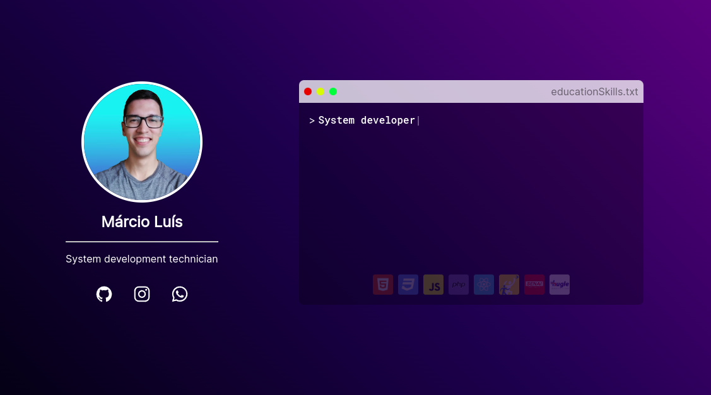

<h1 align="center"> About Márcio </h1>

## Project

My about page aims to list all my main skills as regards web development, the education degrees I completed along my journey as a developer and also available ways to contact me with simple and dynamic features.

### Languages

- HTML
- CSS
- JavaScript
- PHP
- Java

### Frameworks

- Bootstrap
- JQwery
- React
- Next
- Nest
- Laravel

### Education

- HighSchool - Colégio Embraer (2014 - 2016)
- System development - SENAI (2019 - 2021)
- English - Hugle Education (2019 - 2023)

## Tecnologies

This project was built with the core web tecs, such as:

- HTML
- CSS
- JavaScript

Versions with:

- Git
- Github

## References

- [Ion-icons](https://ionic.io/ionicons) by Ionic. Check the usage of their open source icons [here.](https://ionic.io/ionicons/usage)

- [Typed.js](https://github.com/mattboldt/typed.js/) library by mattboldt. Check his website [here.](www.mattboldt.com) 

- [Discover](https://www.rocketseat.com.br/discover) project from Rocketseat. Join their discord comunity [here.](https://discord.gg/rocketseat)
